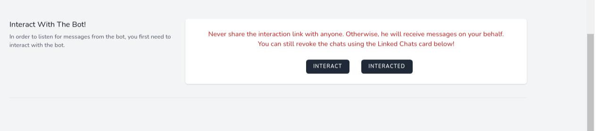
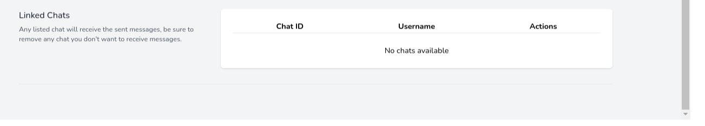
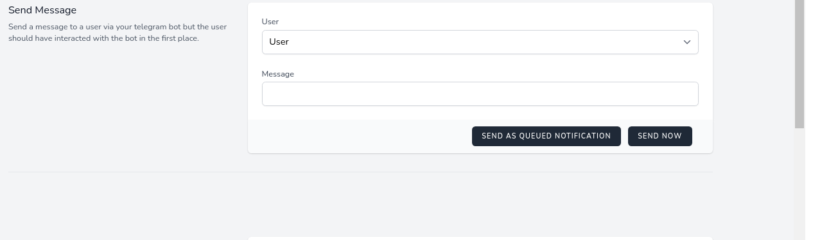

# Telegram Bot Integration Demo

## What this demo is about

Imagine you have an e-commerce app, and some users requests to receive the receipts via Telegram.

But, of course, it is bad to do that manually and you want to automate the process, so you want to make integration with Telegram Bot API. However, there are some limitations in the Telegram Bot API 

1. Telegram Bot API does not allow you to send messages to anyone directly otherwise the users will be spammed by random bots. so that your users must interact with the bots in order for them to receive messages from you via your bot.

2. If the interaction is done, you can not easily know who is this user and how they will be linked together.


This demo mainly provides 4 components:

#### Interact With The Bot



After clicking the **INTERACT** button, a new tab will open which will open telegram app.
and the user must click the **/start** message at this point,
otherwise this demo won't work.

After that, the user may click **INTERACTED** button where the app can fetch the updates from telegram bot api, and link
the chat with the current user.

#### Telegram Webhook

Telegram bot api provides a webhook out of the box which sends the messages to the backend, and it is supported in this
demo.

We just use it to link the chats with the users and no more!

#### Linked Chats



Here you will find all your linked chats, and of course, you can revoke one of them.

When sending a message, all the chats for the user will receive the same message.

#### Send Message



Sending a message to a user is simple. you need to select a user, type a message and finally clicking the **SEND NOW**.

However, for better performance, instead of sending the request directly, you can queue the message, and let the workers
send it for you with retry mechanism! by clicking **SEND AS QUEUED NOTIFICATION**

### What is so special of this demo?

If you want to send a message from your bot to some user, you need to link your user with the bot using the chats. but
how can you know which chats belong to whom?

In this demo, each user has unique random generated token. And the user must open his own link provided by this demo to
interact with the bot.

After the interaction, the webhook (or getUpdates api) sends us each message including chat_id.

We filter the message by `/start ${token}` and if it matches, we extract the token and chat_id, find the user with that token, and create a new chat record.

Now we can use `chat_id` to send the user a message.

This is it!

#### Requirements

- composer
- php ^8.0
- docker

#### Stack

- PHP
- Laravel
- MySQL
- Laravel Sail: for local development using docker and docker compose
- NPM
- tools: phpcsfix, grumphp

#### Main Packages

- irazasyed/telegram-bot-sdk
- laravel-notification-channels/telegram
- JetStream
- Debug Bar
- Livewire

#### Installation & First Time Running Locally

1. Clone the project
2. Run the following script

```bash
cp .env.example .env
composer install --ignore-platform-reqs
./vendor/bin/sail up -d
./vendor/bin/sail artisan migrate:fresh --seed
./vendor/bin/sail npm install
./vendor/bin/sail npm run dev
```

For queued notifications, make sure you run

```bash
./vendor/bin/sail artisan queue:work
```

Now you can visit http://localhost and use the following credentials

#### Local Credentials

|  Email           | Password  |
|  --------------- | --------- |
|  admin@admin.com | 1234  |

#### Get Your Bot Ready

Ask [@BotFather](https://t.me/botfather) for a new bot or your bot token and replace it in .env file with the
key `TELEGRAM_BOT_TOKEN`

#### Development

```bash
./vendor/bin/sail up -d
```

Then watch for any changes

```bash
./vendor/bin/sail npm run watch
```

And if you want to send queued notifications, make sure you run

```bash
./vendor/bin/sail artisan queue:work
```

#### Tests

```bash
./vendor/bin/sail test
```

with code coverage

```bash
./vendor/bin/said test --coverage-html reports
```

### CI / CD

No support for now as this is a demo project. however, feel free to ping me
at [ite.anjd@gmail.com](mailto:ite.anjd@gmail.com) for help if you are interested in using gitlab or circleci as CI/CD.

### Reports or Feedback

Any feedback is welcome and feel free to report any issue.
